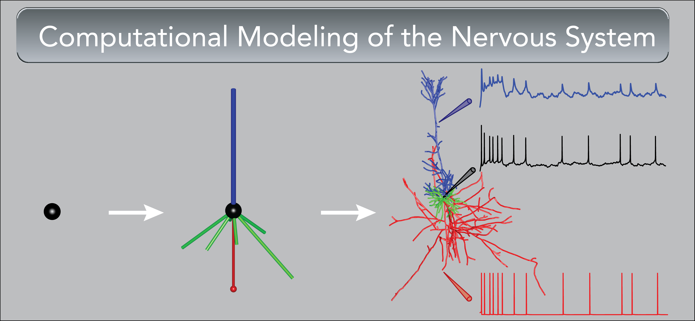

# CompModNervSystem

This repository contains course materials for the Computational Modeling of the Nervous System (Biol74.03/Biol177) offered at Dartmouth College.

You can find the syllabus [here](https://docs.google.com/document/d/1zyncq3cRnoLq6Ha-_GUp3cKewd20cjGTPC_xapx-Oy0/edit) and a link to all exercises [here](https://github.com/CompModNervSystem/CompModNervSystem/tree/main/exercises)

# Student Instructions

We will be using [Github](https://github.com) and [Google colaboratory](https://colab.research.google.com) in this course to distribute, write, and run simulation code. 

To get setup, start by making Github and Google accounts if you don't already have one. While we will be using Canvas for most communication and sharing of readings or assignment files, links to the exercises can be found in this repository. The exercises are contained in *template repositories*, which are Github repositories that allow users to make a new repository (that they own) with the same directory structure and files. This will mainly be useful for exercises with several files. 

